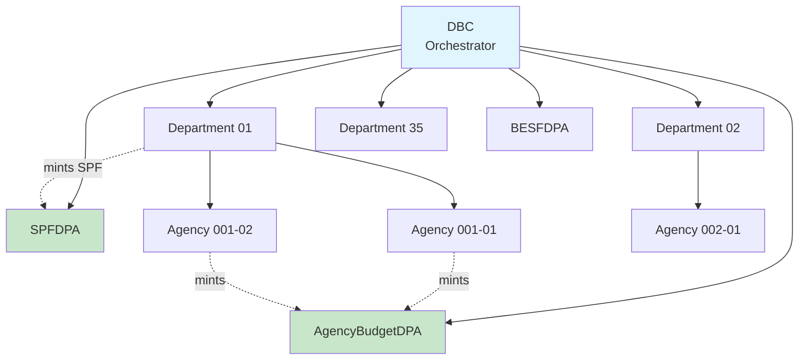

# 🏛️ GAA Contracts - Architecture Guide

> Understanding the contract hierarchy, relationships, and interaction patterns.

---

## 📊 System Overview

```
┌─────────────────────────────────────────────────────────────────────────────────┐
│                                 GAA ECOSYSTEM                                   │
├─────────────────────────────────────────────────────────────────────────────────┤
│                                                                                 │
│   ┌───────────────────────────────────────────────────────────────────────┐     │
│   │                         DBC (Orchestrator)                            │     │
│   │  • Phase Management  • Department Registry  • DPA Registry            │     │
│   └───────────────────────────────────────────────────────────────────────┘     │
│                           │                                                     │
│         ┌─────────────────┼─────────────────┬─────────────────┐                 │
│         │                 │                 │                 │                 │
│         ▼                 ▼                 ▼                 ▼                 │
│   ┌───────────┐      ┌───────────┐    ┌───────────────┐   ┌─────────────┐       │
│   │Department │      │Department │    │AgencyBudgetDPA│   │   SPFDPA    │       │
│   │    01     │      │    02     │    │  (DPA)        │   │  (DPA)      │       │
│   └─────┬─────┘      └─────┬─────┘    └───────────────┘   └─────────────┘       │
│         │                  │                                                    |
│    ┌────┴────┐         ┌───┴────┐                                               │
│    │         │         │        │                                               │
│    ▼         ▼         ▼        ▼                                               │
│ ┌──────┐  ┌──────┐ ┌──────┐  ┌──────┐                                           │
│ │Agency│  │Agency│ │Agency│  │Agency│                                           │
│ │001-01│  │001-02│ │002-01│  │002-02│                                           │
│ └──────┘  └──────┘ └──────┘  └──────┘                                           │
│                                                                                 │
└─────────────────────────────────────────────────────────────────────────────────┘
```

---

## 🔗 Contract Hierarchy



---

## 📦 Contract Descriptions

### Core Contracts

| Contract | Purpose | Inheritance |
|----------|---------|-------------|
| **DBC** | Central orchestrator for the entire GAA system | `Ownable`, `Pausable`, `ReentrancyGuard` |
| **Department** | Represents a government department with agency management | `Ownable` |
| **Agency** | Represents an agency that submits budget expenditures | `Ownable` |

### DPA Contracts (NFT Assets)

| Contract | Purpose | Inheritance |
|----------|---------|-------------|
| **AgencyBudgetDPA** | DPA tokens for agency budget entries | `DPA` (from @dpa-oss/dpa) |
| **SPFDPA** | DPA tokens for Special Purpose Funds | `DPA` |
| **BESFDPA** | DPA tokens for BESF entries (placeholder) | `DPA` |

---

## 🔄 Interaction Flows

### 1. Budget Submission Flow

```
┌──────────┐       ┌────────────┐       ┌─────────┐       ┌────────────────┐
│  Agency  │──────▶│ Department │──────▶│   DBC   │──────▶│AgencyBudgetDPA │
│  Owner   │ call  │  Contract  │verify │ submit  │ mint  │    ERC721      │
│          │submit │            │ phase │ agency  │ token │                │
│          │ Exp.  │            │       │ exp.    │       │                │
└──────────┘       └────────────┘       └─────────┘       └────────────────┘
     │                                        │                   │
     │                                        │                   │
     └───────────────────Token ID ────────────┼───────────────────┘
                                              │
                                        ┌─────▼─────┐
                                        │  Events   │
                                        │  Emitted  │
                                        └───────────┘
```

**Step-by-step:**
1. Agency Owner calls `agency.submitExpenditure()`
2. Agency forwards to DBC via `dbc.submitAgencyExpenditure()`
3. DBC validates phase, encodes content
4. DBC calls AgencyBudgetDPA to mint token
5. Token ID returned to Agency
6. Events emitted for indexing

---

### 2. SPF Submission Flow

```
┌─────────────────┐       ┌─────────┐       ┌─────────┐
│  Responsible    │──────▶│   DBC   │──────▶│ SPFDPA  │
│  Minting Dept   │ submit│ validate│  mint │ ERC721  │
│     Owner       │  SPF  │  phase  │ token │         │
└─────────────────┘       └─────────┘       └─────────┘
```

**Note:** Only the designated "Responsible Minting Department" can submit SPF expenditures.

---

### 3. Phase Transition Flow

```
Phase 0: PREPARATION
        │
        │ transitionToMinting() [Owner]
        ▼
Phase 1: MINTING
        │
        │ transitionToEnactment() [Responsible Minting Dept]
        ▼
Phase 2: ENACTMENT
        │
        │ transitionToFinality() [Responsible Enactment Dept]
        ▼
Phase 3: FINALITY
        │
        │ completeAndReset() [Responsible Enactment Dept]
        ▼
Phase 0: PREPARATION (New Fiscal Year)
```

---

## 🏗️ Contract Relationships

### Ownership Chain

```
       ┌─────────────┐
       │   Deployer  │  (EOA - External Owned Account)
       │   (Owner)   │
       └──────┬──────┘
              │ owns
              ▼
       ┌─────────────┐
       │     DBC     │
       └──────┬──────┘
              │ registers
              ├───────────────────┬─────────────────┐
              ▼                   ▼                 ▼
       ┌───────────┐      ┌────────────────┐  ┌───────────┐
       │Department │      │AgencyBudgetDPA │  │  SPFDPA   │
       │  (Owner)  │      │   (DBC=Orch)   │  │(DBC=Orch) │
       └─────┬─────┘      └────────────────┘  └───────────┘
             │ creates
             ▼
       ┌───────────┐
       │  Agency   │
       │ (DPA Mgr) │
       └───────────┘
```

### Data Flow

```
┌─────────────────────────────────────────────────────────────────┐
│                         ON-CHAIN DATA                           │
├─────────────────────────────────────────────────────────────────┤
│                                                                  │
│  DBC                     Department              Agency          │
│  ├─ fiscalYear           ├─ code                 ├─ code        │
│  ├─ currentPhase         ├─ name                 ├─ name        │
│  ├─ departments[]        ├─ mainAgency           ├─ department  │
│  ├─ agencyBudgetDPA      └─ agencies[]           └─ dbc         │
│  └─ spfDPA                                                       │
│                                                                  │
│  AgencyBudgetDPA                      SPFDPA                    │
│  ├─ tokenContent[]                    ├─ tokenContent[]         │
│  │   ├─ expenseType                   │   ├─ expenseType        │
│  │   ├─ amount                        │   ├─ amount             │
│  │   ├─ departmentCode                │   ├─ fundingSourceCode  │
│  │   ├─ departmentName                │   ├─ spfCategoryName    │
│  │   ├─ agencyCode                    │   ├─ recipientCode      │
│  │   └─ agencyName                    │   └─ recipientName      │
│  └─ tokenURI[]                        └─ tokenURI[]             │
│                                                                  │
└─────────────────────────────────────────────────────────────────┘
                              │
                              │ IPFS CID
                              ▼
┌─────────────────────────────────────────────────────────────────┐
│                        OFF-CHAIN DATA                           │
├─────────────────────────────────────────────────────────────────┤
│                                                                  │
│  IPFS (Pinata)                                                  │
│  ├─ Metadata JSON (ERC721)                                      │
│  │   ├─ name                                                    │
│  │   ├─ description                                             │
│  │   ├─ image → Data JSON CID                                   │
│  │   └─ attributes[]                                            │
│  │                                                              │
│  └─ Data JSON                                                   │
│      ├─ department_code                                         │
│      ├─ department_name                                         │
│      ├─ agency_code                                             │
│      ├─ agency_name                                             │
│      ├─ expense_type_*                                          │
│      └─ total_amount                                            │
│                                                                  │
└─────────────────────────────────────────────────────────────────┘
```

---

## 🔐 Access Control Matrix

| Function | DBC Owner | Dept Owner | Agency Owner | Resp. Minting | Resp. Enactment |
|----------|:---------:|:----------:|:------------:|:-------------:|:---------------:|
| `pause/unpause` | ✅ | ❌ | ❌ | ❌ | ❌ |
| `registerDepartment` | ✅ | ❌ | ❌ | ❌ | ❌ |
| `registerDPA` | ✅ | ❌ | ❌ | ❌ | ❌ |
| `transitionToMinting` | ✅ | ❌ | ❌ | ❌ | ❌ |
| `addAgency` | ❌ | ✅ | ❌ | ❌ | ❌ |
| `submitExpenditure` | ❌ | ❌ | ✅ | ❌ | ❌ |
| `submitSPFExpenditure` | ❌ | ❌ | ❌ | ✅ | ❌ |
| `transitionToEnactment` | ❌ | ❌ | ❌ | ✅ | ❌ |
| `transitionToFinality` | ❌ | ❌ | ❌ | ❌ | ✅ |
| `completeAndReset` | ❌ | ❌ | ❌ | ❌ | ✅ |

---

## 📁 Contract Files

```
contracts/
├── DBC.sol                      # Main orchestrator
├── Department.sol               # Department management
├── Agency.sol                   # Agency with expenditure submission
├── dpa/
│   ├── AgencyBudgetDPA.sol     # NFT for agency budgets
│   ├── SPFDPA.sol              # NFT for SPFs
│   └── BESFDPA.sol             # NFT for BESF (placeholder)
└── shared/
    ├── GAATypes.sol            # Shared structs & enums
    ├── GAAErrors.sol           # Custom error definitions
    ├── IGAAContracts.sol       # Department/Agency interfaces
    └── IDPAContracts.sol       # DPA interfaces
```

---

## 🔌 External Dependencies

| Package | Version | Purpose |
|---------|---------|---------|
| `@openzeppelin/contracts` | ^5.0.0 | Ownable, Pausable, ReentrancyGuard |
| `@dpa-oss/dpa` | ^1.0.3 | DPA base contract (ERC721A + content) |
| `erc721a` | ^4.3.0 | Gas-efficient ERC721 (via DPA) |

---

## 📡 Event-Based Integration

### Key Events to Listen

```solidity
// Budget lifecycle
event AgencyExpenditureSubmitted(tokenId, agency, expenseType, amount)
event SPFExpenditureSubmitted(tokenId, submitter, expenseType, amount)

// Phase changes
event PhaseChanged(oldPhase, newPhase)
event FiscalYearIncremented(oldYear, newYear)

// Structure changes
event DepartmentRegistered(codeHash, code, department)
event AgencyAdded(codeHash, code, agency)

// Token events (ERC721)
event Transfer(from, to, tokenId)
```

---

## 💡 Key Design Decisions

1. **DBC as Single Orchestrator**
   - All departments and DPAs register with DBC
   - Phase transitions controlled centrally
   - Enables system-wide pausing

2. **Department → Agency Hierarchy**
   - Mirrors government structure
   - Each department has a "main agency" (same code)
   - Agencies are created by department

3. **DPA Content Storage**
   - Budget data stored on-chain in encoded bytes
   - Decoding via typed getter functions
   - IPFS for full metadata (ERC721 standard)

4. **Phase-Based Operations**
   - Preparation: Setup only
   - Minting: Token creation allowed
   - Enactment: System locked
   - Finality: Archive, then reset

---

## License

MIT
